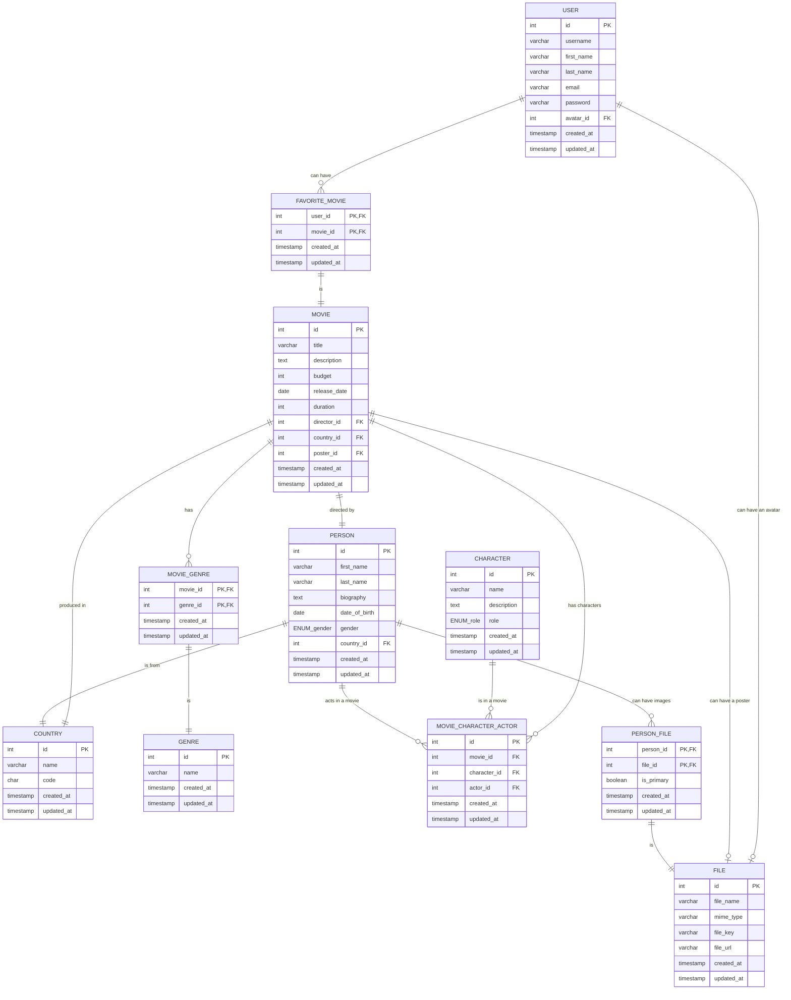

This repository contains the structure of a database for movies application and several queries to it. 
The ER-diagram looks as follows:

```mermaid
erDiagram
    FILE {
        int id PK
        varchar file_name
        varchar mime_type
        varchar file_key
        varchar file_url
        timestamp created_at
        timestamp updated_at
    }

    USER {
        int id PK
        varchar username
        varchar first_name
        varchar last_name
        varchar email
        varchar password
        int avatar_id FK
        timestamp created_at
        timestamp updated_at
    }

    COUNTRY {
        int id PK
        varchar name
        char code
        timestamp created_at
        timestamp updated_at
    }

    PERSON {
        int id PK
        varchar first_name
        varchar last_name
        text biography
        date date_of_birth
        ENUM_gender gender
        int country_id FK
        timestamp created_at
        timestamp updated_at
    }

    MOVIE {
        int id PK
        varchar title
        text description
        int budget
        date release_date
        int duration
        int director_id FK
        int country_id FK
        int poster_id FK
        timestamp created_at
        timestamp updated_at
    }

    GENRE {
        int id PK
        varchar name
        timestamp created_at
        timestamp updated_at
    }

    MOVIE_GENRE {
        int movie_id PK, FK
        int genre_id PK, FK
        timestamp created_at
        timestamp updated_at
    }

    CHARACTER {
        int id PK
        varchar name
        text description
        ENUM_role role
        timestamp created_at
        timestamp updated_at
    }

    MOVIE_CHARACTER_ACTOR {
        int id PK
        int movie_id FK
        int character_id FK
        int actor_id FK
        timestamp created_at
        timestamp updated_at
    }

    PERSON_FILE {
        int person_id PK, FK
        int file_id PK, FK
        boolean is_primary
        timestamp created_at
        timestamp updated_at
    }

    FAVORITE_MOVIE {
        int user_id PK, FK
        int movie_id PK, FK
        timestamp created_at
        timestamp updated_at
    }

    USER ||--o| FILE : "can have an avatar"
    MOVIE ||--o| FILE : "can have a poster"
    MOVIE ||--|| PERSON : "directed by"
    MOVIE ||--|| COUNTRY : "produced in"
    MOVIE ||--o{ MOVIE_GENRE : "has"
    MOVIE_GENRE ||--|| GENRE : "is"
    MOVIE ||--o{ MOVIE_CHARACTER_ACTOR : "has characters"
    CHARACTER ||--o{ MOVIE_CHARACTER_ACTOR : "is in a movie"
    PERSON ||--o{ MOVIE_CHARACTER_ACTOR : "acts in a movie"
    PERSON ||--|| COUNTRY : "is from"
    PERSON ||--o{ PERSON_FILE : "can have images"
    PERSON_FILE ||--|| FILE : "is"
    USER ||--o{ FAVORITE_MOVIE : "can have"
    FAVORITE_MOVIE ||--|| MOVIE : "is"
```